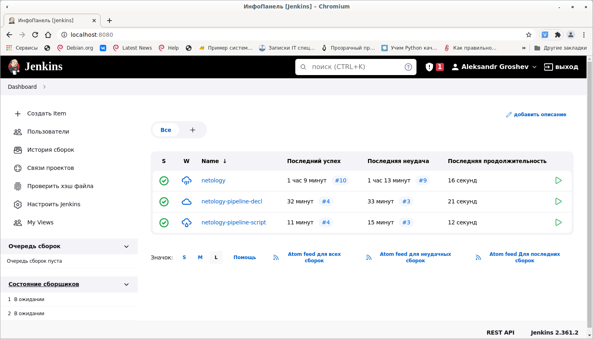

# Домашнее задание к занятию "09.03 Jenkins"

Все пункты задания выполнены успешно.

Jenkinsfile
```
pipeline {
    agent any

    stages {
        stage('Checkout') {
            steps {
                git 'https://github.com/alexgro1982/example-playbook.git'
            }
        }
        stage('Deploy') {
            steps {
                ansiblePlaybook inventory: 'inventory/prod.yml', playbook: 'site.yml'
            }
        }
    }
}
```  

ScriptedJenkinsfile  

```
node("built-in"){
    stage("Git checkout"){
        git branch: 'main', credentialsId: 'f4cfb207-e585-4e31-bfb6-8ea1f4f47483', url: 'https://github.com/alexgro1982/jenkins.git'
    }
    stage("Check ssh key"){
        secret_check=true
    }
    stage("Run playbook"){
        if (secret_check){
            sh 'ansible-playbook site.yml -i inventory/prod.yml'
        }
        else{
            echo 'no more keys'
        }
        
    }
}
```

Скриншот главной страницы Jenkins

